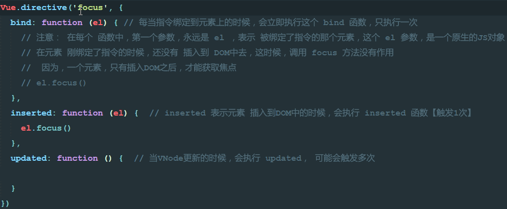

## 基本
- el：将要控制的元素
- data：数据
    + vm会自动监听数据的改变，只要数据改变，会自动渲染最新的数据。
- methods：这个对象里面存当前Vue实例所有可用的方法。
## v-cloak指令
- 解决网速慢时{{mag}}闪烁问题。要加样式
```
[v-cloak] {
    display:none;
}
```
## v-text指令
- `v-text="msg"`默认能解决网速慢时闪烁问题，和`{{ mag }}`最终效果一样
- 但是v-test会覆盖元素中原本的内容，但是插值表达式只替换自己占位符，不会清空整个内容。
## v-html指令
- 会将标签解析为html输出。
## v-bind指令
- v-bind:提供属性绑定
- 简写形式，省略v-bind，只留一个:即可
## v-on指令
- v-on:click="show"
- method: {shwo: function() {}}
- 缩写是@
- 事件处理函数绑定时可以加小括号，例如`@click='show()'`
    - 加小括号后就可以给事件处理函数传递参数了
## v-model指令
- 实现双向数据绑定(数据变了页面中的变，同样在页面中修改后data中的数据也会变，即双向)
- 使用v-bind只能实现数据的单向绑定，从M到V
- v-model='属性名'可实现双向绑定。
- v-model只能运用在表单元素中
- 复习eval(),解析执行字符串。
- [v-model计算器案例](../code/v-model计算器.html)
## v-for指令
- 迭代数组
```javascript
<p v-for='item in list'>{{item}}</p>
//<p v-for='(item,i) in list'>索引值：{{i}}----{{item}}</p>
data: {
    list: [1,2,3,4,5]
}
```
- 循环对象数组
    - 也可以加入第二个参数：索引
```javascript
<p v-for='item in list'>{{item.name}}</p>
data: {
    {id:1,name:'zs'},
    {id:2,name:'lisi'}
}
```
- 循环对象
    - 参数的顺序是：值、键、索引
    - 绑定key可以避免渲染时出现的混乱:key='item.id'(key必须是唯一的字符串或数字)
```javascript
<p v-for='(val,key,index) in user'>{{val}}---{{key}}---{{index}}</p>
data: {
    user: {
        id: 1,
        name: 'zs',
        gender: '男'
    }
}
```
- 迭代数字
    - 使用v-for迭代数字是从1开始，不是从0开始
```javascript
<p v-for='count in 10'>这是第{{count}}次迭代</p>
```
## v-if指令和v-show指令
- `v-if`指令会直接让元素删除或创建
- `v-show`指令是给元素加了个display:none属性(没有DOM的删除和创建)
- 如果元素需要频繁的切换，最好不要使用v-if，尽量使用v-show
- v-show有初始渲染消耗
## 自定义全局指令(以v-开头)
- 使用Vue.directive()
    - 参数1，指令名称，定义时不用加v-，在调用时必须加v-
    - 参数2，是个对象，对象上有相关函数

- 钩子函数
- 和js行为相关的一般放在inserted中去
- 和样式相关的一般放在bind中去
