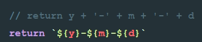

## 品牌添加与删除，搜索过滤
### 删除中用到的方法
- 删除原理：根据该行商品的id,找到索引值，然后在list数组中删除该索引的商品对象，vue会自动监听数据的变化并重新渲染页面
- 数组splice()方法，用于添加和删除
    - 用法：arrayObject.splice(索引值,要删除的个数,新增1,.....,新增x)
    - 返回：被删除的数组
- some()方法，判断元素是否符合特定的条件。在some()中如果return ture，就会立即终止数组的后续循环
- forEach()是遍历每一项，没法被终止
- findIndex()方法，返回符合条件的数组第一个元素索引值
- 给删除按钮的a链接要添加.prevent事件修饰符，阻止默认的点击跳转事件
### 搜索框过滤
- chrome浏览器安装vue.js调试工具：vue-devtools
- data中定义keywords绑定到搜索框
- indexOf()方法，判断是否包含，如果不等于-1，则认为包含
    - 其中如果是str1.indexOf('')，则返回值为0，也不等于-1，所以包含空字符串
- filter()方法，回调判断，返回值是一个过滤后的新数组
- es6新增includes()方法，如果包含则返回true
- 思路：不能用data中写死的list作渲染，这时候v-for绑定一个函数，search(keywords)，返回一个关键词过滤后的新数组
### 全局过滤器(格式化日期格式)
- 作用：文本格式化
- 只能用在mustache插值和v-bind表达式
- 过滤器并不修改原数据，只是对原数据进行一些处理
- 字符串的replace()方法第一个参数可以写一个字符串，也可以写一个正则 /要替换的字符/g
- 过滤器可以多次调用
- 模板字符串

```javascript
Vue.filter('过滤器名', function(data,arg) {
    //data默认就是要用过滤器处理的这个变量
    //arg第二个变量可有可无，如果有就代表使用过滤器时传入的参数
    //还可以传多个参数
})
//使用时
{{name | 过滤器名(arg)}}
```
- 所有的vm实例都能共享这个过滤器
### 私有过滤器
- 在vm实例内部和data，methods一个级别
- filters {}
- 采用就近原则，如果和全局同名，则优先调用私有过滤器
```javascript
<div id="app2">
    <h3>{{date | dateFormat}}</h3>
</div>
var vm2 = new Vue({
    el: '#app2',
    data: {
        date: new Date()
    },
    filters: {
        dateFormat: function (date) {
            var dt = new Date(date);
            var year = dt.getFullYear();
            var month = dt.getMonth() + 1;
            var day = dt.getDate();
            var hour = dt.getHours();
            var min = dt.getMinutes();
            var sec = dt.getSeconds();
            //使用模板字符串，快速格式化
            return `${year}-${month}-${day} ${hour}:${min}:${sec} 私有过滤器`
        }
    }
})
```
- 解决一位补0的方法：使用es6的字符串方法padStart()和padEnd()
- padStart(maxlength,'要填充的字符串')
### 自定义按键修饰符
- 解决问题：按回车键添加
- 绑定事件keyup后要对enter键进行监听
- 全局自定义按键修饰符，例如给f10绑定，`Vue.config.keyCodes.f10 = 121`